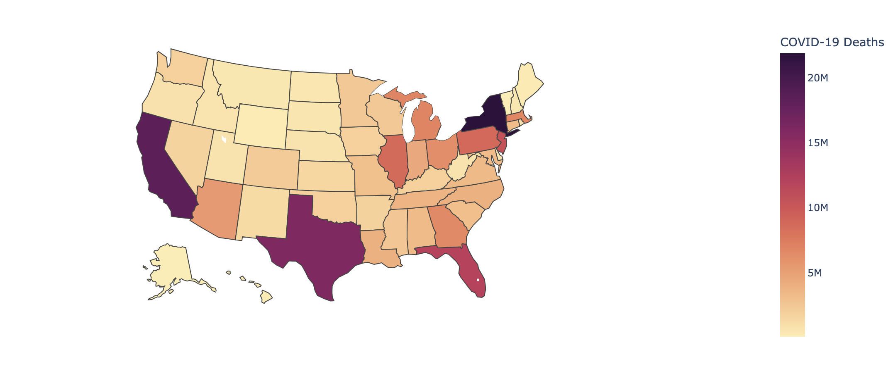
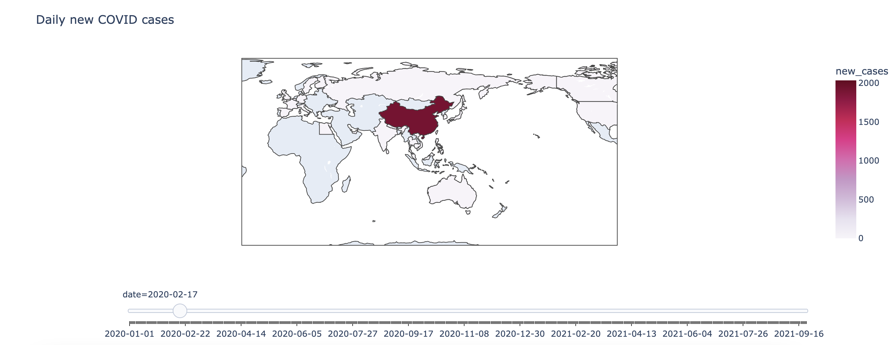
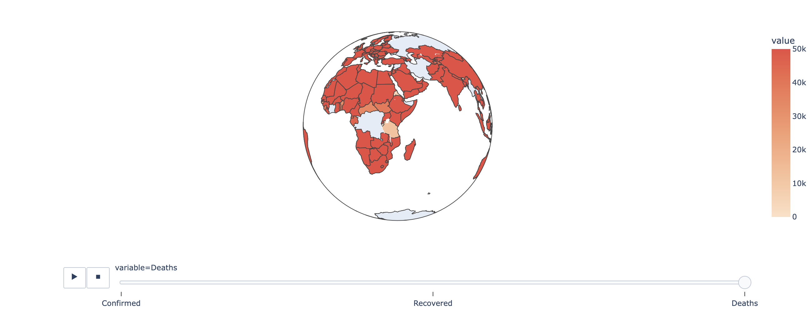

# Data-Science-Workshop
Data Science Workshop including installing libraries, importing libraries, getting the dataset, total worldwide cases in the US vs. Worldwide cases, daily US cases and deaths, US deaths, choropleth maps, china map, worldwide daily covid cases map confirmed, recovered and death cases across the globe.

